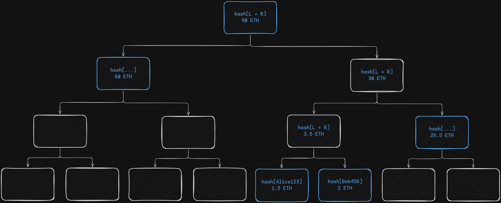
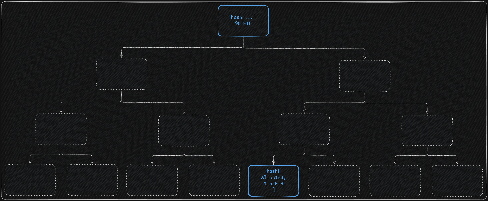

# ZK Proof of Liabilities

A Zero-Knowledge Proof of Liabilities implementation in Noir.

It allows a company to cryptographically prove to each user that their balance
is correctly included in its total liabilities without revealing any data from
the other users.

- [Background](#background)
- [Circuit design](#circuit-design)
  - [Limitations](#limitations)
- [References](#References)

## Background

**How can you trust that a Centralized Exchange actually holds your funds?**

The CEX would need to provide a _Proof of Solvency_:

> Proof of Solvency: Proof that the company is holding enough funds to cover
> **all** of their customers' balances.

That proof can be constructed using two other proofs:

- _Proof of Assets_: Prove that the company holds X amount
- _Proof of Liabilities_: Prove that the company's total users balances amount
  to Y

Having those two proofs, one just needs to verify that X is greater than or
equal to Y.

Proof of Assets is trivial: The company can provide a cryptographic signature
with the corresponding key to the wallet holding the funds.

**Proof of Liabilities is where the challenge lies**: How can each user know
that their balance is included in the total liabilities of the company?

The company cannot simply publish a list of all the usernames and associated
balances because then the users would have no privacy. Hashing the username with
a private salt that is only shared with the respective user is an improvement,
but still leaks the user count, all the balances and how those change over time.

A better solution is to use a _Merkle Sum Tree_. It behaves like a regular
Merkle tree, but each node also carries a balance equal to the sum of its
children's balances, with the root representing the total liabilities.

However, it's still not private enough: A user, Alice, would still know the
balance of another user that corresponds to her sibling leaf in the tree, would
also know the sum of balances of other two users, and so on and so forth... If
Alice had access to more accounts she could start to extract more balance
information.

**The solution is to use Zero-Knowledge Proofs** where, instead of sharing the
Merkle proof directly with the user, the CEX generates a ZKP of their inclusion
in the tree. The user can then verify the generated proof against his user hash
(which is a hash computed with their username, nonce and balance), the committed
root hash and total liabilities, ideally done on-chain. No sibling information
or any other user data is revealed in the process.

For implementation details, read the [Circuit design](#circuit-design) section.

## Circuit design

The Noir circuit is composed of a Merkle Sum Tree inclusion verification
algorithm with the following inputs:

| Input name         | Visibility |       Type       | Description                                            |
| ------------------ | :--------: | :--------------: | ------------------------------------------------------ |
| `path_indices`     | _PRIVATE_  |  `[u1; DEPTH]`   | Left/right (0/1) path from the user's leaf to the root |
| `sibling_hashes`   | _PRIVATE_  | `[Field; DEPTH]` | Hash of each sibling node along the path               |
| `sibling_balances` | _PRIVATE_  | `[Field; DEPTH]` | Balance of each sibling node along the path            |
| `root_hash`        |  _PUBLIC_  |     `Field`      | The Merkle Sum Tree root hash                          |
| `root_balance`     |  _PUBLIC_  |     `Field`      | Total liabilities                                      |
| `user_hash`        |  _PUBLIC_  |     `Field`      | Hash of the user's leaf verified off-chain by the user |
| `user_balance`     | _PRIVATE_  |     `Field`      | The user's balance                                     |
| `user_id`          | _PRIVATE_  |     `Field`      | Hash of the user's username and nonce                  |

The Nargo workspace is comprised 2 crates:

- The `zk_proof_of_liabilities` binary crate that provides sensible defaults
- The `merkle_sum_tree` library crate that allows for customization and
  integration into other circuits

The customization happens via the following generics:

- `DEPTH: u32`: The Merkle sum tree depth (`zk_proof_of_liabilities` uses `20`,
  which equates to $2^{20} = 1,048,576$ maximum users)
- `MAX_BALANCE_BITS: u32`: The bit-length of the balances
  (`zk_proof_of_liabilities` uses `128`, which equates to a maximum balance (or
  sum) of $2^{128} - 1 = 340,282,366,920,938,463,463,374,607,431,768,211,455$)
- `FIELD_BITS: u32`: The bit-length of the prime field used
  (`zk_proof_of_liabilities` uses `254` to be compatible with the Barretenberg
  backend)
- `H: MerkleSumTreeHasher`: Custom hasher trait (`zk_proof_of_liabilities` uses
  the BN254-compatible `Poseidon2` hasher)

The circuit asserts the following constraints:

- The user leaf (ID and balance) is included in the Merkle Sum Tree
- The sum has been performed correctly from the user leaf until the root node
- No balance or computed amount exceeds `2^MAX_BALANCE_BITS`, preventing
  overflow and negative value exploits

The circuit uses Noir's native `Field` type for all values rather than fixed
width integers, since field arithmetic has fewer constraints. The valid range is
enforced via `MAX_BALANCE_BITS` rather than relying on the type system.

The `Poseidon2` hash was chosen for its efficiency inside circuits due to the
lower number of constraints compared to general-purpose hashes like Keccak,
while offering similar security.

Although the circuit doesn't enforce it, it is recommended for the `user_id`
(also called ID) to be comprised of the hash of not only the username but also a
random nonce privately shared with the user. This prevents an attack on the
public input `user_hash`, which could be observed on-chain by the RPCs, where
one could try to bruteforce `hash[username, balance]` to deanonymize the user.

### Limitations

The trade-off is that we're trusting the CEX to generate the Merkle proof
honestly. The circuit checks for Merkle proof correctness, but the CEX could add
some fake users with negative balances to decrease the total liabilities.

This is only detectable by users whose sibling nodes contain a manipulated
balance, since the range constraint would reject a balance that wraps around the
field modulus. Any other users in the tree would receive valid proofs.

Therefore, the proof relies on a sufficient number of users verifying their
proofs, which of course cannot be enforced. The more users verify, the harder it
becomes for the CEX to manipulate the tree without being caught.

## References

- Vitalik Buterin's original proposal which inspired this project:
  https://vitalik.eth.limo/general/2022/11/19/proof_of_solvency.html
- Summa for their extensive research on ZK proof of solvency:
  https://pse.dev/projects/summa
